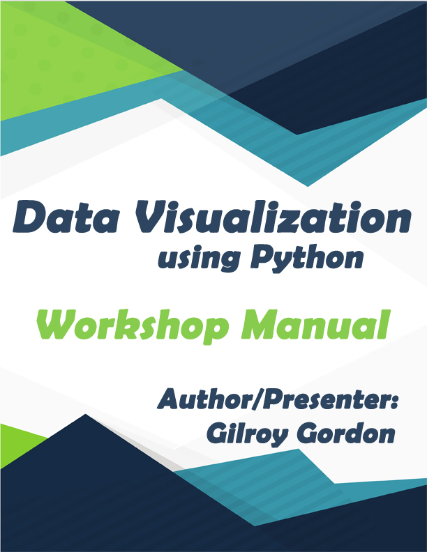

# Data Visualization using Python
### Workshop Resources
#### Facilitator and Presenter : G. Gordon

This online repository contains additional resources to supplement the workshop and manual made available by G. Gordon. 

NB. The data used in this workshop is not owned or managed by the auhtor/presenter and was retrieved from https://www.kaggle.com/ludobenistant/hr-analytics . Any use of the data, should consider the guidelines under which the data set is provided.

If you are interested in the manual, feel free to contact me with ggordon [_at ] igonics.com

Copyright G. Gordon 2017
